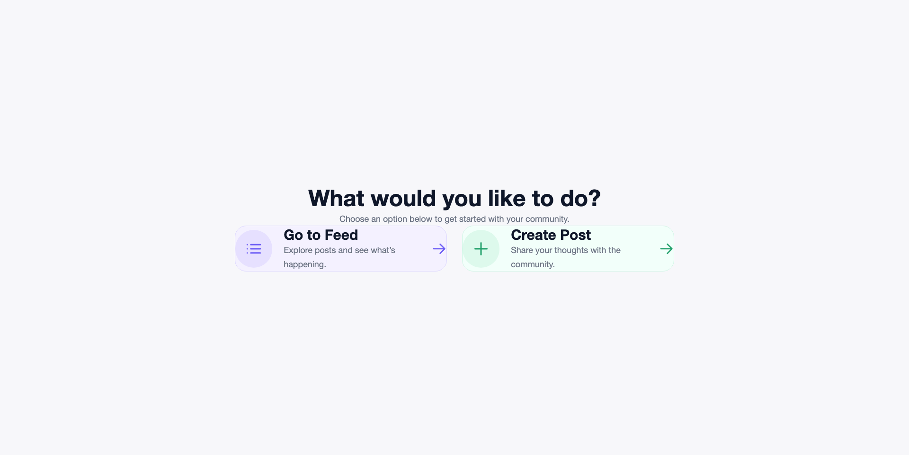

📸 Project Insta

A full-stack Instagram-inspired social media application built with the MERN stack. Users can upload posts, view image feeds, and interact with a responsive modern UI.

🚀 Live Demo

* Frontend:  Project Insta Live Demo
* Backend API:  Backend API
* GitHub Repository:  GitHub Repository

⸻

✨ Features

* 📤 Upload image posts
* 📝 Add captions to posts
* 🖼️ Responsive image feed
* ⚡ Real-time API integration
* 🔒 Rate limiting for API protection
* 📁 Image upload validation
* 🌐 Fully deployed frontend & backend
* 📱 Responsive UI for mobile and desktop

⸻

🛠️ Tech Stack

Frontend

* React.js
* Vite
* Axios
* Tailwind CSS

Backend

* Node.js
* Express.js
* MongoDB
* Mongoose
* Multer
* CORS
* Express Rate Limit

Deployment

* Frontend:  Vercel
* Backend:  Render
* Database:  MongoDB Atlas

⸻

📂 Project Structure
```bash
project_insta/
│
├── Backend/
│   ├── src/
│   ├── server.js
│   └── package.json
│
├── frontend/
│   ├── src/
│   ├── public/
│   └── package.json
│
└── README.md
```
⸻

⚙️ Environment Variables

Create a .env file inside the backend folder.
```bash
PORT=10000
MONGO_URI=your_mongodb_connection
IMAGEKIT_PUBLIC_KEY=your_public_key
IMAGEKIT_PRIVATE_KEY=your_private_key
IMAGEKIT_URL_ENDPOINT=your_url_endpoint
```

Create a .env file inside the frontend folder.
```bash
VITE_API_URL=https://your-render-url.onrender.com
```
⸻

📦 Installation & Setup

1. Clone the repository
```bash
git clone https://github.com/Akhil9982/project_insta.git
```
⸻

2. Install dependencies

Backend
```bash
cd Backend
npm install
```
Frontend
```bash
cd frontend
npm install
```
⸻

3. Start the development servers

Backend
```bash
npm start
```
Frontend
```bash
npm run dev
```
⸻

🔗 API Endpoints

Create Post

```bash
POST /create-post
```
### Form Data

| Key | Type |
|---|---|
| image | File |
| caption | String |

⸻

Get All Posts

```bash
http

GET /posts
```
⸻

🛡️ Backend Security Features

* Request rate limiting
* File type validation
* File size restriction
* Centralized error handling
* Secure environment variables

⸻

📸 Screenshots



⸻

🚀 Future Improvements

* User authentication
* Like & comment system
* JWT authorization
* Infinite scrolling feed
* User profiles
* Cloud image optimization

⸻

👨‍💻 Author

* GitHub:  Akhil9982 GitHub Profile